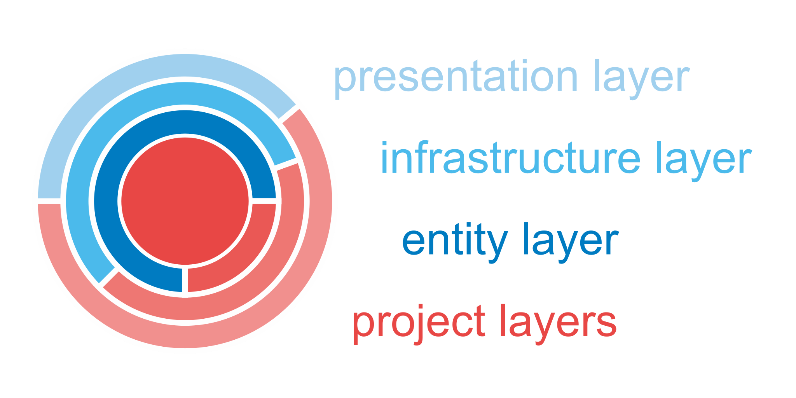

# 

## Introduction

#### Welcome

The goal of the **TeleScope** project is to create reusable nuget packages that are based strongly on clean architecture principles.

#### Status

| GitHub Actions and Status |
| ------------------------- |
| 
| 
| 

#### TOC

* [Introduction](#introduction)
* [Usage](#usage)
* [Development](#development)

## Usage

The TeleScope repository contains one solution with lots of [NuGet](https://www.nuget.org/profiles/telescope-dotnet) packages.
These packages may be used within your domain specific application in different layers depending on your architectural approach. 

#### Clean Architecture

The intention of this project is to support applications that follow the clean architecture principles. There might be differences in naming the architectural layers, but the theory remains the same.
> Keeping your business logic clean, which means free from breaking changes through external dependencies.

Of course the TeleScope packages are external dependencies to other projects. Nevertheless, TeleScope provides reusable and extensible entities and their implementations within infrastructure and presentation layers, like shown below.



#### NuGet Packages

###### Versioning

The NuGet versions follow the [Semantic Versioning](https://semver.org/) pattern.
If a version is in state `0.x.x`, this indicates that the package is not used in productive environments so far and
that feature updates also may cause breaking changes. 

<!-- Connectors -->
<table>
<thead>
<tr align="center"><th colspan="2">

[TeleScope.Connectors.*](https://www.nuget.org/packages?q=TeleScope.Connectors)

</th></tr>
</thead>
<tbody>
<tr align="center">
<td colspan="2">

[](https://www.nuget.org/packages/TeleScope.Connectors.Abstractions/)

</td>
</tr>
<tr align="center">
<td>

[](https://www.nuget.org/packages/TeleScope.Connectors.Mqtt.Abstractions/)


</td>
<td>

[](https://www.nuget.org/packages/TeleScope.Connectors.Plc.Abstractions/)

</td>
</tr>
<tr align="center">
<td>

[](https://www.nuget.org/packages/TeleScope.Connectors.Mqtt/)

</td>
<td>

[](https://www.nuget.org/packages/TeleScope.Connectors.Plc.Siemens/)

</td>
</tr>
</tbody>
</table>

<!-- Persistence -->
<table>
<thead>
<tr align="center"><th colspan="3">

[TeleScope.Persistence.*](https://www.nuget.org/packages?q=TeleScope.Persistence)

</th></tr>
</thead>
<tbody>
<tr align="center">
<td colspan="3">

[](https://www.nuget.org/packages/TeleScope.Persistence.Abstractions/)

</td>
</tr>

<tr align="center">
<td>

[](https://www.nuget.org/packages/TeleScope.Persistence.Json/)

</td>
<td>

[](https://www.nuget.org/packages/TeleScope.Persistence.Csv/)

</td>
<td>

[](https://www.nuget.org/packages/TeleScope.Persistence.Parquet/)

</td>
</tr>
</tbody>
</table>

<!-- UI -->
<table>
<thead>
<tr align="center"><th colspan="2">

[TeleScope.UI.*](https://www.nuget.org/packages?q=TeleScope.UI)

</th></tr>
</thead>
<tbody>
<tr align="center">
<td>

[](https://www.nuget.org/packages/TeleScope.UI.Cli/)

</td>
</tr>
</tbody>
</table>

<!-- Logging -->
<table>
<thead>
<tr align="center"><th colspan="2">

[TeleScope.Logging.*](https://www.nuget.org/packages?q=TeleScope.Logging)

</th></tr>
</thead>
<tbody>
<tr align="center">
<td>

[](https://www.nuget.org/packages/TeleScope.Logging/)

</td>
</tr>

<tr align="center">
<td>

[](https://www.nuget.org/packages/TeleScope.Logging.Extensions.Serilog/)

</td>
</tr>
</tbody>
</table>


#### Documentation

* The public [Repository](https://github.com/telescope-dotnet/telescope)
* The official [API Documentation and Reference manual](https://telescope-dotnet.github.io/telescope/)

```markdown
* Mention supportes
* Create a list with links, maybe to important resources,
* to wiki pages or staging servers
```

## Development

`will come soon`

~~~markdown
Step by step explanation about how to get the project running, preferably with command line examples that can be copy-pasted by readers

#### Prerequisites
* Information about the recommended IDE
* Runtime environment and frameworks that needs to be preinstalled
* **These are just example requirements. Add, duplicate or remove as required**

#### OS X & Linux
```sh
- get_command
- install_command
- configure_command
- run_command
```

#### Windows
```sh
- get_command
- install_command
- configure_command
- run_command
```
#### Goals or TODOs
- [ ] Your major next steps and
- [ ] planned long-term features

#### Known Issues
- [ ] known bugs or
- [ ] limitations
~~~
