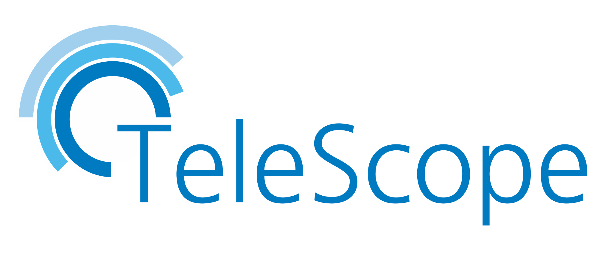
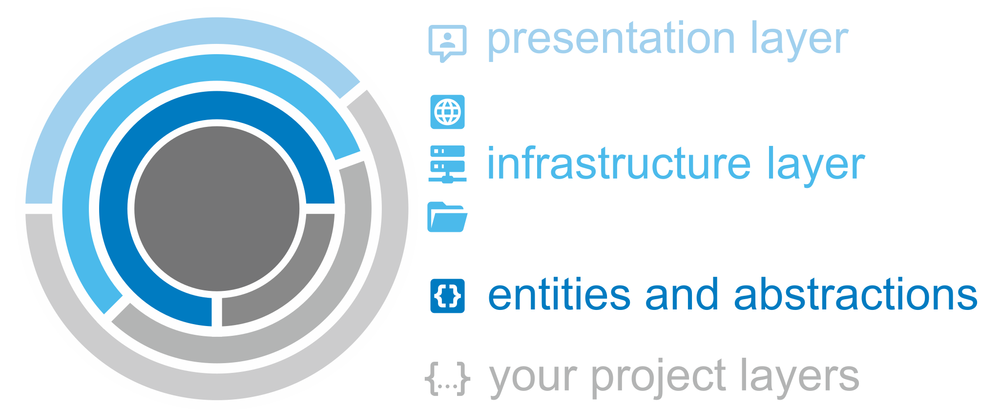

# 

##### Table of Content

* [Introduction](#introduction)
* [Usage](#usage)
* [Development](#development)

## Introduction

#### Welcome

* **TeleScope** is a framework written in C# that provides loosely coupled modules for several cross-cutting concerns.
* The assemblies provide connections to external services, access to the persistence layer and helper for logging or user interactions.
* The goal of the project is to create reusable NuGet packages that are based strongly on Clean Architecture Principles.

#### Status

| GitHub Actions and Status |
| ------------------------- |
| 
| 
| 
| 

## Usage

#### Documentation

* The public [Repository](https://github.com/telescope-dotnet/telescope).
* The official [API Documentation and Reference manual](https://telescope-dotnet.github.io/telescope/).

#### NuGet Packages

The TeleScope repository contains one solution with lots of **[NuGet packages](https://www.nuget.org/profiles/telescope-dotnet)**.
These packages may be used within your domain specific application in different layers depending on your architectural approach. 

###### Versioning

The NuGet versions follow the [Semantic Versioning](https://semver.org/) pattern.
If a version is in state `0.x.x`, this indicates that the package is not used in productive environments so far and
that feature updates also may cause breaking changes. 

<!-- Connectors -->

| [TeleScope.Connectors.*](https://www.nuget.org/packages?q=TeleScope.Connectors) | Packages |
| ------------ | --- |
| Abstractions | 
| Mqtt         |  
| Http         |  
| Plc          |  
| Smtp         |  

| [TeleScope.Persistence.*](https://www.nuget.org/packages?q=TeleScope.Persistence) | Packages |
| ------------ | --- |
| Abstractions | 
| Json         |  
| Yaml         |  
| Csv          | 
| Parquet      | 

| [TeleScope.UI.*](https://www.nuget.org/packages?q=TeleScope.UI) | Packages |
| ------------ | --- |
| Cli          | 
| Permissions  | 

| [TeleScope.Logging.*](https://www.nuget.org/packages?q=TeleScope.Logging) | Packages |
| ------------ | --- |
| Logging      | 
| Serilog      | 

## Development

`will come soon`