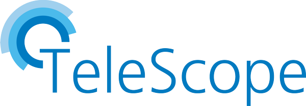

# 

## Introduction

#### Welcome

The goal of the **TeleScope** project is to create reusable nuget packages that are based strongly on clean architecure principles.

#### Status

| GitHub Actions and Status |
| ------------------------- |
| 
| 
| 

#### TOC

* [Introduction](#introduction)
* [Usage](#usage)
* [Development](#development)

## Usage

The TeleScope repository contains one solution with lots of [NuGet](https://www.nuget.org/profiles/telescope-dotnet) packages.
These packages may be used within your domain specific application in different layers depending on your architectural approach. 

#### Clean Architecture

`will be written soon`


#### NuGet Packages

###### Versioning

The NuGet versions follow the [Semantic Versioning](https://semver.org/) pattern.
If a version is in state `0.x.x`, this indicates that the package is not used in productive environments so far and
that feature updates also may cause breaking changes. 

<table>
<thead>
<tr align="center"><th colspan="2">
  
[TeleScope.Connectors.*](https://www.nuget.org/packages?q=TeleScope.Connectors)
  
</th></tr>
</thead>
<tbody>
<tr align="center">
<td colspan="2">
  
[](https://www.nuget.org/packages/TeleScope.Connectors.Abstractions/)

</td>
</tr>
<tr align="center">
<td rowspan="2">
  
MQTT.Abstractions
  
</td>
<td>
  
[](https://www.nuget.org/packages/TeleScope.Connectors.Plc.Abstractions/)
  
</td>
</tr>
<tr align="center">
<td>

[](https://www.nuget.org/packages/TeleScope.Connectors.Plc.Siemens/)

</td>
</tr>
</tbody>
</table>

<table>
<thead>
<tr align="center"><th colspan="2">
  
[TeleScope.UI.*](https://www.nuget.org/packages?q=TeleScope.UI)
  
</th></tr>
</thead>
<tbody>
<tr align="center">
<td>
  
[](https://www.nuget.org/packages/TeleScope.UI.Cli/)

</td>
</tr>
</tbody>
</table>

#### Worth Knowing

* The public [Repository](https://github.com/telescope-dotnet/telescope)
* The official [API Documentation and Reference manual](https://telescope-dotnet.github.io/telescope/)

```markdown
* Mention supportes
* Create a list with links, maybe to important resources,
* to wiki pages or staging servers
```

## Development

`will come soon`

~~~markdown
Step by step explanation about how to get the project running, preferably with command line examples that can be copy-pasted by readers

#### Prerequisites
* Information about the recommended IDE
* Runtime environment and frameworks that needs to be preinstalled
* **These are just example requirements. Add, duplicate or remove as required**

#### OS X & Linux
```sh
- get_command
- install_command
- configure_command
- run_command
```

#### Windows
```sh
- get_command
- install_command
- configure_command
- run_command
```
#### Goals or TODOs
- [ ] Your major next steps and
- [ ] planned long-term features

#### Known Issues
- [ ] known bugs or
- [ ] limitations
~~~
