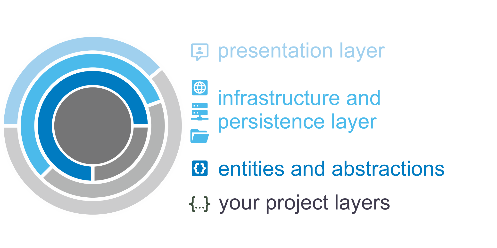

# TeleScope **DOCUMENTATION**

> TeleScope is a framework written in C# that provides loosely coupled modules for several cross-cutting concerns.

> The assemblies provide connections to external services, access to the persistence layer and helper for logging or user interactions.

> The goal of the project is to create reusable NuGet packages that are based strongly on Clean Architecture Principles.

## Structure of this page
 
| [Articles](articles)   | [API Documentation](api)   |
| :--------------------: | :------------------------: | 
| Provides explanations of major implementations and examples... **in the near in the future**.  | Provides descriptions about the entire public API like classes, their methods, events, members and so on.

## Quick Start

The TeleScope project provides lots of **[NuGet packages](https://www.nuget.org/profiles/telescope-dotnet)**.
These packages may be used within your domain specific application in different layers depending on your architectural approach. 

### Packages

#### [Connectors](#tab/connectors)

| [TeleScope.Connectors.*](https://www.nuget.org/packages?q=TeleScope.Connectors) | Packages |
| ------------ | --- |
| Abstractions | 
| Mqtt         |  
| Http         |  
| Plc          |  

#### [Persistence](#tab/persistence)

| [TeleScope.Persistence.*](https://www.nuget.org/packages?q=TeleScope.Persistence) | Packages |
| ------------ | --- |
| Abstractions | 
| Json         |  
| Yaml         |  
| Csv          | 
| Parquet      | 

#### [Logging](#tab/loging)

| [TeleScope.Logging.*](https://www.nuget.org/packages?q=TeleScope.Logging) | Packages |
| ------------ | --- |
| Logging      | 
| Serilog      | 

#### [User Interfaces](#tab/ui)

| [TeleScope.UI.*](https://www.nuget.org/packages?q=TeleScope.UI) | Packages |
| ------------ | --- |
| Cli          | 

---

### Clean Architecture Principle

The intention of this project is to support applications that follow any architectural approach.
One best practice is the *Clean Architecture Principle*.
There might be differences in the naming of your architectural layers, but the theory remains the same.

> Keeping your business logic clean, which means free from breaking changes through external dependencies or implementations.

Of course the TeleScope packages are external dependencies for other projects. Nevertheless,
TeleScope separates its entities from their implementations so that other projects may inject the code where it is needed.
Additionally, you can take advantage of the example implementations or you are also free to create your own implementation based 
on the interfaces TeleScope provides.
