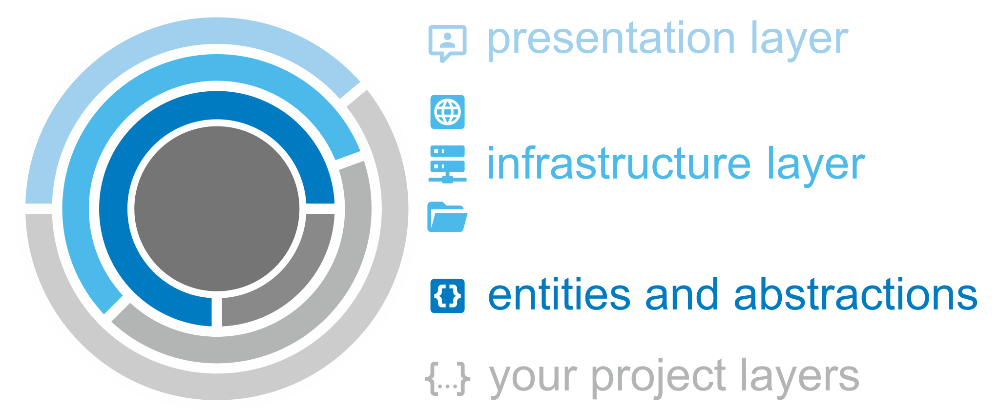

# TeleScope **DOCS**

<div style="font-size:1.3em;color:#337ab7;">

:sparkles: The project aims for any project type or distant targets, just like a <b>telescope</b>.

:gem: The NuGet packages are strongly based on <b>Clean Architecture Principles</b> and are encapsukated to maximize their reusability.

:books: The framework contains of <b>15+ packages for cross-cutting concerns</b>, 
like connectors to external services, persistence layer and helpers for client code or user interactions.

</div>


## :telescope: Structure of this site
 
| <span style="font-size:1.3em"> :clipboard: [Articles](articles) | <span style="font-size:1.3em"> :books: [API Documentation](api)</span> |
| :---------------------------------------------------------: | :---------------------------------------------------------------------------: | 
| **Explore examples** and further explanations about major features. In the next time there will be examples about all cathegories.  | **Discover the entire public API**. Classes, methods, events, members and so on are described with the auto-generated documentation.


## :rocket: Quick Start

The TeleScope project provides separate **[NuGet packages](https://www.nuget.org/profiles/telescope-dotnet)** 
for abstractions and implementations.
Please use the assemblies within a particular application layer, depending on whether an abstraction or its implementation is needed.

Simply install the desired packages in your preferred way with NuGet Package Manager, CLI or xml reference. 

#### [Package Manager](#tab/nuget)

```bash
PM> Install-Package TeleScope.{awesome-package} -Version 2.*.*
```

#### [CLI](#tab/cli)

```bash
> dotnet add package TeleScope.{awesome-package} --version 2.*.*
```

#### [Reference](#tab/reference)

```xml
<PackageReference Include="TeleScope.Connectors.Abstractions" Version="2.0.0" />
```

>[!NOTE]
> For projects that support PackageReference, copy this XML node into the project file to reference the package.

---


### NuGet Packages

A full overview of all provided packages can be found below.

#### [General](#tab/general)

| [TeleScope.*](https://www.nuget.org/packages?q=TeleScope) | Packages |
| ------------ | --- |
| GuardClauses | [](https://www.nuget.org/packages/TeleScope.GuardClauses/)
| Logging      | [](https://www.nuget.org/packages/TeleScope.Logging/) [](https://www.nuget.org/packages/TeleScope.Logging.Extensions.Serilog/)


#### [Connectors](#tab/connectors)

| [TeleScope.Connectors.*](https://www.nuget.org/packages?q=TeleScope.Connectors) | Packages |
| ------------ | --- |
| Abstractions | [](https://www.nuget.org/packages/TeleScope.Connectors.Abstractions/)
| Mqtt `beta`  | [](https://www.nuget.org/packages/TeleScope.Connectors.Mqtt.Abstractions/) [](https://www.nuget.org/packages/TeleScope.Connectors.Mqtt/)
| Http         | [](https://www.nuget.org/packages/TeleScope.Connectors.Http.Abstractions/) [](https://www.nuget.org/packages/TeleScope.Connectors.Http/)
| Plc `beta`   | [](https://www.nuget.org/packages/TeleScope.Connectors.Plc.Abstractions/) [](https://www.nuget.org/packages/TeleScope.Connectors.Plc.Siemens/)
| Smtp         | [](https://www.nuget.org/packages/TeleScope.Connectors.Smtp.Abstractions/) [](https://www.nuget.org/packages/TeleScope.Connectors.Smtp/)

#### [Persistence](#tab/persistence)

| [TeleScope.Persistence.*](https://www.nuget.org/packages?q=TeleScope.Persistence) | Packages |
| ------------ | --- |
| Abstractions | [](https://www.nuget.org/packages/TeleScope.Persistence.Abstractions/)
| Json         | [](https://www.nuget.org/packages/TeleScope.Persistence.Json/) 
| Yaml         | [](https://www.nuget.org/packages/TeleScope.Persistence.Yaml/) 
| Csv          | [](https://www.nuget.org/packages/TeleScope.Persistence.Csv/)
| Parquet      | [](https://www.nuget.org/packages/TeleScope.Persistence.Parquet/)

#### [User Interfaces](#tab/ui)

| [TeleScope.UI.*](https://www.nuget.org/packages?q=TeleScope.UI) | Packages |
| ------------ | --- |
| Cli          | [](https://www.nuget.org/packages/TeleScope.UI.Cli/)

---

## :globe_with_meridians: Clean Architecture Principles

**The TeleScope project supports any architectural approach, but it was designed for Clean Architecture projects.** 
There might be differences in naming this architectural approach or its layers, but the goal remains the same.

>[!NOTE]
> Keep your business logic clean and free from external dependencies or their breaking changes.




The implementation of follows the ideals of <a href="https://blog.cleancoder.com/uncle-bob/2012/08/13/the-clean-architecture.html" target="_blank">Uncle Bob</a> and <a target="_blank" href="https://www.codingflow.net/">Jason Taylor</a> - so 
thank you both! :beers:

Of course, TeleScope packages are external dependencies for other projects. 
So TeleScope separates its entities from the implementations, so that other projects may inject them where they are needed.
Additionally, you can take advantage of the example implementations or you are also free to create your own implementations.
